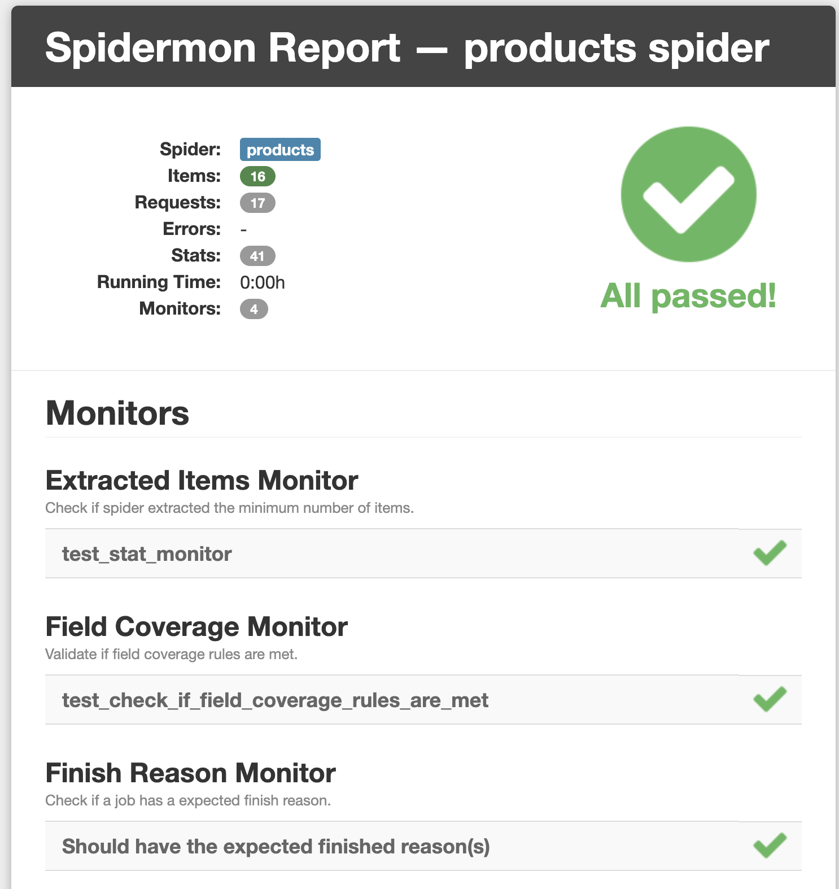

# 🕷️ Spidermon Assistant Skill

A Claude skill that acts as your all-in-one expert for [Spidermon](https://spidermon.readthedocs.io/) — the open-source monitoring framework for Scrapy spiders. It gathers your project context interactively and generates fully copy-pasteable, production-ready code with zero placeholders.

Suggested Use : Using Claude code within your existing Scrapy Project

⚠️ Disclaimer : This is not an official skill from Zyte and not thoroughly tested, I advice you to take a backup of your project and run it in a project copy.
⚠️ There's a known compatibility issue with Spidermon and Scrapy >=2.14 (https://github.com/scrapinghub/spidermon/issues/473) 

Usage : 

1. Provide 1-2 sample scraped item from your successful scraped JSON
2. Invoke spidermon-assistant skill 

Example Prompt: 

To CLaude Code :
```
This is an item from my scrapy run, help me setup spider (using spidermon-assistant skill)

{"name": "ShadowMesh – EDC All-Over Print Bandana Mask", "price": "490.00", "url": "https://example.com/products/bandana"}
```
Claude will read the current project structure, create schema.json, download spidermon and jinja2(for HTML reporting), create monitor.py and enable spidermon in settings.py

Claude will ask you : 
1. How much items you're expecting to scrape from a successful run (To verify number of items matches your expectations)
2. Do you want an HTML report for spidermon run? (Yes/No)

If instead of claude code, you run it in claude chat, it will direct you to file additions and code snippet edits, although I'd highly advice to run it using claude code.

For a scrapy project using scrapy-poet, less than 50 items, my cost to setup spidermon was : 
```
  claude-haiku-4-5:  400 input, 18 output, 0 cache read, 0 cache write ($0.0005)
  claude-sonnet-4-6:  30 input, 9.8k output, 822.8k cache read, 53.6k cache write ($0.60)

- (~US$0.60) 
```

, YMMV!

---

### Sample Report 

)

## What it does

Instead of reading docs and piecing together boilerplate yourself, you describe your spider and the assistant generates everything you need:

- **JSON validation schemas** inferred from your actual scraped items
- **`monitors.py`** with a complete `MonitorSuite` wired to your project
- **`settings.py` snippets** with all required Spidermon configuration
- **Expression monitors** from plain-English rules
- **Troubleshooting guidance** from your crawl logs

All output uses your real project name, spider name, and item class — nothing to find-and-replace.

---

## Workflows

### 1. Schema Generator
Provide a sample scraped item (JSON, Python dict, Scrapy Item class, or plain English) and get a complete JSON schema with smart type inference, URL/email/price patterns, and the `settings.py` lines to enable validation.

### 2. Monitor Bootstrapper
Describe your spider (what it scrapes, expected item counts, critical fields) and get a production-ready `monitors.py` + `settings.py` with item count, field coverage, finish reason, and error monitors — plus optional Slack/Telegram/Discord/email notifications.

### 3. Config Advisor
Paste your existing `settings.py` and/or `monitors.py` for a gap analysis: missing settings, misconfigured monitors, version compatibility issues, and concrete improvement suggestions.

### 4. Expression Builder
Describe monitoring rules in plain English ("fail if fewer than 50 items" / "alert if error rate exceeds 1%") and get the corresponding `SPIDERMON_SPIDER_CLOSE_EXPRESSION_MONITORS` configuration.

### 5. Troubleshooter
Paste Spidermon log output (lines containing `[Spidermon]`, validation stats, FAILED/PASSED results, or error tracebacks) and get a root-cause diagnosis with exact fixes.

---

## Key features

- **Interactive elicitation first** — asks for project name, spider name, item type, Scrapy version, expected item count, and scrapy-poet usage before generating anything
- **Scrapy 2.13+ compatibility checks** — detects when the user's Scrapy version is affected by the `process_item()` deprecation that breaks `ItemValidationPipeline` in Spidermon ≤ 1.25.0, and provides the downgrade path
- **Zero-placeholder output** — all generated code uses real names gathered in the elicitation step
- **Common pitfalls baked in** — `SPIDERMON_MAX_ITEM_VALIDATION_ERRORS` always included when needed, correct extension class name (`Spidermon` not `SpiderMonitor`), class-object keys for `SPIDERMON_VALIDATION_SCHEMAS`
- **HTML report support** — optionally generates `CreateFileReport` action wiring and report settings (requires `jinja2`)
- **scrapy-poet aware** — handles attrs/dataclass items, correct import paths, and field coverage prefix for Page Object–based projects
- **Post-output diagnostics** — every response ends with run commands, log grep patterns, and an offer to debug

---

## Usage

Trigger this skill by mentioning Spidermon or any related concept:

```
/spidermon-assistant I need to set up monitoring for my e-commerce spider
```

```
/spidermon-assistant Here's my sample item: {"title": "Blue Widget", "price": 9.99, "url": "https://shop.com/widget"}
```

```
/spidermon-assistant [paste Spidermon log output here]
```

```
/spidermon-assistant Fail the run if fewer than 100 items were scraped or if error rate exceeds 2%
```

---

## Skill structure

```
spidermon-assistant/
├── SKILL.md                              ← Routing logic and all five workflows
└── references/
    ├── spidermon-knowledge-base.md       ← Settings, monitors, actions, schema patterns
    └── output-templates.md               ← Validated code templates for all item types
```

The skill reads `references/spidermon-knowledge-base.md` before every generation step and selects the correct template variant from `references/output-templates.md` based on the user's item type (plain dict, dataclass, attrs, or Scrapy Item) and scrapy-poet usage.

---

## Requirements

The generated code targets:

| Package       | Required  | Notes                                          |
|---------------|-----------|------------------------------------------------|
| `spidermon`   | Always    | Tested against 1.25.0                         |
| `jsonschema`  | Always    | Required for `ItemValidationMonitor`           |
| `jinja2`      | Optional  | Only if HTML reports are enabled               |
| `scrapy`      | Always    | Supports Scrapy < 2.13 for full compatibility  |

Install with pip or uv:

```bash
# pip
pip install spidermon jsonschema

# uv
uv pip install spidermon jsonschema
```

---

## Example output

Given a sample item and project context, the skill generates three files:

**`myproject/schemas/products_schema.json`**
```json
{
  "$schema": "http://json-schema.org/draft-07/schema",
  "type": "object",
  "properties": {
    "title":    { "type": "string", "minLength": 1 },
    "price":    { "type": "number", "exclusiveMinimum": 0 },
    "url":      { "type": "string", "pattern": "^https?://" },
    "in_stock": { "type": "boolean" }
  },
  "required": ["title", "price", "url", "in_stock"]
}
```

**`myproject/monitors.py`** — a complete `SpiderCloseMonitorSuite` with `ItemCountMonitor`, `FinishReasonMonitor`, `FieldCoverageMonitor`, and `ItemValidationMonitor`, all using your real class and spider names.

**`settings.py` additions** — the `EXTENSIONS`, `SPIDERMON_SPIDER_CLOSE_MONITORS`, `SPIDERMON_VALIDATION_SCHEMAS`, `SPIDERMON_MAX_ITEM_VALIDATION_ERRORS`, and `ITEM_PIPELINES` entries, ready to paste.

---

## Related resources

- [Spidermon documentation](https://spidermon.readthedocs.io/)
- [Spidermon GitHub](https://github.com/scrapinghub/spidermon)
- [Scrapy documentation](https://docs.scrapy.org/)
- [JSON Schema reference](https://json-schema.org/understanding-json-schema/)
